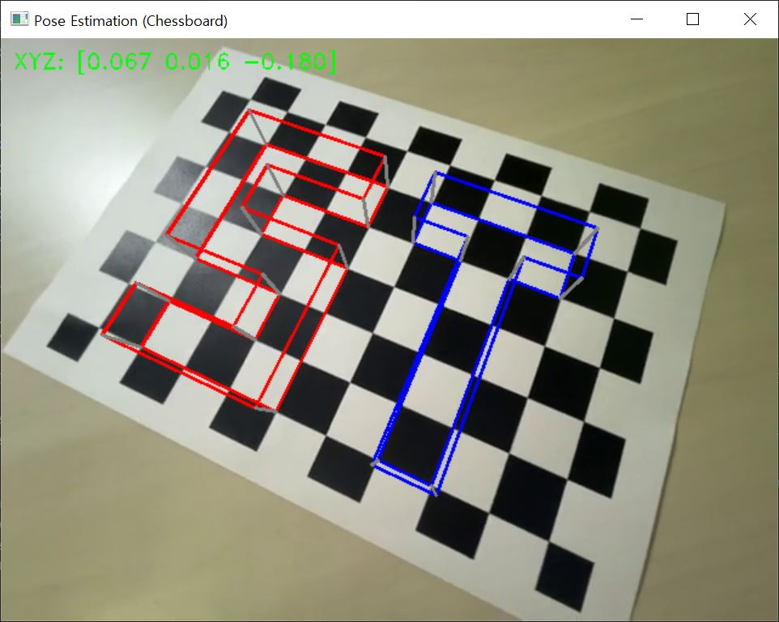

# Pose Estimator with AR Object Visualization

## 목적

이 프로그램은 OpenCV를 통해 내 카메라를 캘리브레이션하여 카메라의 포즈를 알아내고, AR 기법을 응용하여 영상에 간단한 AR 물체를 표시합니다.

## 기능

### 카메라 포즈 추정

- 카메라 캘리브레이션을 통해 내부 매개변수를 보정합니다.
- 이를 통해 카메라의 위치와 방향을 추정합니다.

### AR 물체 시각화

- 추정된 카메라의 포즈를 기반으로 AR 물체를 시각화합니다.
- S와 T 두 개의 3D 물체를 체스보드 위에 표시합니다.

## 사용 방법

1. 비디오 파일을 `example` 폴더에 추가합니다.
2. `pose_estimator.py` 스크립트 내에서 `video_file` 변수를 사용할 비디오 파일의 디렉토리 경로로 설정합니다.
3. 코드를 실행하여 카메라 캘리브레이션을 수행합니다.
4. 추정된 카메라 포즈를 기반으로 AR 물체가 시각화된 영상을 확인합니다.

## 예시 실행 결과

## 주의 사항

- 제대로 된 카메라 캘리브레이션을 위해서는 반드시 1개 이상의 이미지를 선택해야 합니다. 이를 통해 프로그램은 카메라 매트릭스와 왜곡 계수를 올바르게 계산하여 비디오 파일의 왜곡을 보정할 수 있습니다.
